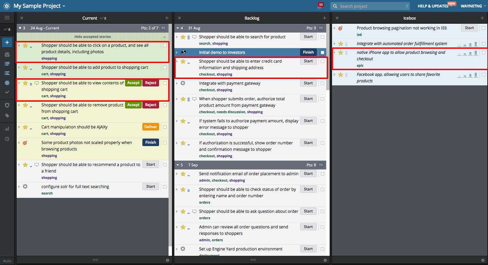
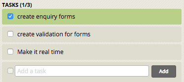
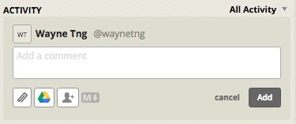

# Pivotal Tracker
**Pivotal Tracker** is an agile project management tool that enables real time collaboration.

A project consists of many functions and features, we break down each requirements into smaller pieces called a Story.

The highlighted in the image below is called a Story

As shown in the image, there are many Stories, each Story is a small requirement or function or feature from the project.

![Fig 2] (../../images/pivotal_tracker/story-information.png)

## 1. Story Name
It is the name of the Story, it should be something straight-forward and easy to infer.

## 2. Story Information

### Story Type
+ Features 
  - This is a feature or function or a requirement - most Story type will be Feature
+ Bugs
  - There are Bugs that require attention, generally this Story type will appear near the end of the project.
+ Chores
  - Chores is something that needs to be done but doesn’t provide any real value. As much as possible, this should not appear in the project at all.
+ Release
  - Completion of certain important milestone, such as the project is ready for Alpha/Beta testing or full project completion. It is also used to demark swim lane 1, 2 and 3.

### Points
Futureworkz adapts a [Fibonacci](https://en.wikipedia.org/wiki/Fibonacci_number) point system: 

+ 1 point
  - A simple feature that estimated to take half a day.
+ 2 points
  - A feature that estimate to take a day.
+ 3 points
  - A feature that estimate to take two days.
+ 5 points
  - A feature that estimate to take three days.
+ 8 points
  - A feature that estimate to take a week.

Note: The point system is a form of guidance. **It is an estimation, not a commitment**, as a project is prompt to changes and it may or may not prolong the duration needed to complete.

### State
During each Story, there are a few stages:
+ Start
  - The team started on the Story
+ Finish
  - The team completed the Story locally but have yet to push it to
Staging
+ Deliver
  - The team uploaded the Story to Staging site
+ Reject
  - There are errors in the Story that created by the team.
  - Note: The error can be as simple as a missing full stop, wrong image to function not working as expected etc. Do not be shy to reject the Story.
+ Accept
  - The team fulfills the expectation and requirement of the Story.

### Requester
+ The point of contact or the product owner.

### Owner
+ The person that fulfills the Story, normally it will be the Coder or Designer.

## 3.Description
This is the portion where more details about the story are added.

It will also contain the instruction of **where** to access the Staging, how to
navigate the system/website to the story and **how** to test the features.

## 4.Labels
To tags the Story for easier grouping/searching purpose.

## Tasks
When the features can be broken down into even smaller pieces, the team will input the smaller pieces into the tasks. As shown in the image below

## Activity
This is the place where all the conversation is being track and record, include design image, content for the respective Story, why the Story is being reject, additional enhancement etc...

Futureworkz strongly encourage all users to keep the communication to the commenting function of Activity. This makes the communication contextual, neatand tidy. Communication such as email or IM may cause potential miscommunication due to lack of context or improper format.

## Velocity
Velocity is a measurement of how fast the team completes the stories.

Velocity is the average points completed per week of the project. It calculates all the total points completed thus far and divide by the total number of weeks spent in the project.

This will give a sense of the project pace and the estimated completion date of the project.

## Do and Don't
### Product Owner
+ Do
  - Accept or reject the story whenever you are available.
  - Reject a story if you are not sure about the story but state clearly what you are not sure about.
  - Communicate via the chat system in the Activity within each Story.
+ Don't
  - Do not start/finish/deliver a Story, they are for the designer/coder to indicate that they started work.
  - Do not create Story, inform/discuss with the Project Manager
  - If there is a need to create a new task, inform/discuss the Project Manager
  - Do not rearrange the Story, discuss with the Project Manager
  - Do not change the Point allocation to the Story, discuss with the Project Manager

### The Development Team
+ Do
  - Use the Task to break down Story into even smaller task. 
  - Provide a test guide for every Story to walkthrough the steps to access and test the function.
+ Don't
  - Do not change the Point allocation to the Story, discuss with the Project Manager. If there a need, a new story should be created.
  - Do not create Story, discuss with the Project Manager
  - Do not rearrange the Story without informing the Project Manager.
